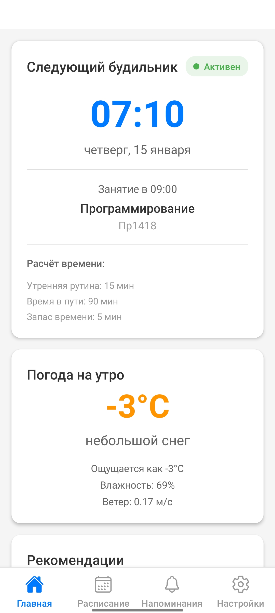
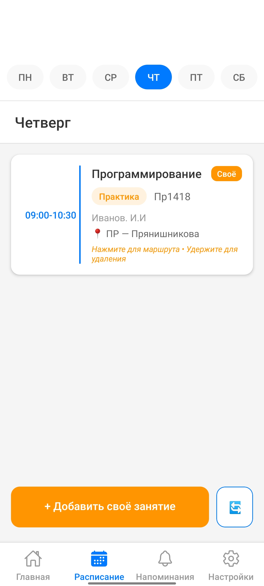
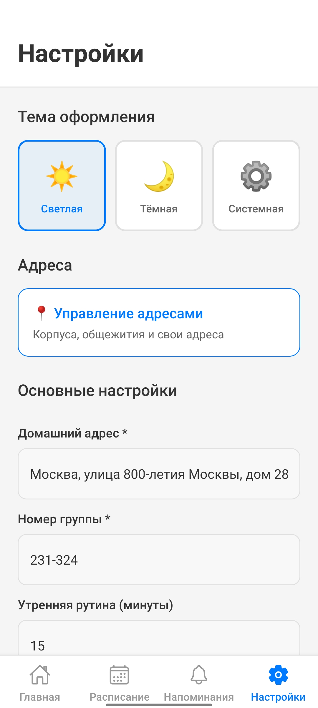

# 🎓 МПУ Companion

> Умный будильник и планировщик для студентов Московского Политеха

[](https://github.com/VolodinDanila/mpu-companion/releases/latest)
[](https://www.android.com/)

<p align="center">
  
  
  
  
</p>

## 📱 О приложении

МПУ Companion — мобильное приложение для студентов МПУ, которое автоматически рассчитывает время будильника на основе вашего расписания, погоды и времени в пути до университета.

### ✨ Основные возможности

- ⏰ **Умный будильник** — автоматический расчёт времени подъёма с учётом:
    - Расписания занятий
    - Времени в пути до корпуса
    - Утренней рутины
    - Запаса времени
- 📅 **Расписание** — автоматическая загрузка с rasp.dmami.ru + свои занятия
- 📍 **Маршруты** — интеграция с Яндекс.Картами для построения маршрутов
- 🌤️ **Погода** — рекомендации по одежде на утро
- 📌 **Напоминания** — создание событий с привязкой к местам
- 🎨 **Темы** — светлая, тёмная и автоматическая
- 📳 **Тактильный отклик** — haptics для всех взаимодействий

## 📥 Установка

### Скачать готовое приложение

1. Перейдите на страницу [Releases](https://github.com/yourusername/mpu-companion/releases)
2. Скачайте последнюю версию `mpu-companion.apk`
3. Установите на Android устройство
4. При необходимости разрешите установку из неизвестных источников

### Требования

- Android 7.0 (API 24) или выше
- ~50 MB свободного места
- Доступ к интернету для загрузки расписания и погоды

## 🛠️ Технологии

- **React Native** — кросс-платформенная разработка
- **Expo** — инфраструктура и инструменты
- **React Navigation** — навигация между экранами
- **AsyncStorage** — локальное хранилище данных
- **Expo Notifications** — уведомления и будильники
- **Expo Haptics** — тактильный отклик
- **OpenWeatherMap API** — данные о погоде
- **Яндекс.Карты API** — построение маршрутов

## 🚀 Запуск для разработки

### Установка зависимостей
```bash
# Клонируйте репозиторий
git clone https://github.com/yourusername/mpu-companion.git
cd mpu-companion

# Установите зависимости
npm install

# Запустите приложение
npx expo start
```

### Запуск на устройстве

**Вариант 1: Expo Go (быстро)**
```bash
npx expo start
# Отсканируйте QR-код в приложении Expo Go
```

**Вариант 2: Android эмулятор**
```bash
npx expo run:android
```

### Настройка API ключей (опционально)

Для полноценной работы погоды создайте `app.config.js`:
```javascript
export default {
  expo: {
    extra: {
      openWeatherApiKey: "ваш_ключ_openweather"
    }
  }
}
```

## 📦 Сборка APK
```bash
# Облачная сборка через EAS
eas build -p android --profile preview

# Локальная сборка через Gradle
npx expo prebuild
cd android
./gradlew assembleRelease
# APK: android/app/build/outputs/apk/release/app-release.apk
```

## 📂 Структура проекта
```
mpu-companion/
├── api/                    # API клиенты
│   ├── routes.js          # Геокодирование и маршруты
│   ├── schedule.js        # Загрузка расписания МПУ
│   └── weather.js         # Погода OpenWeatherMap
├── contexts/              # React Context
│   └── ThemeContext.js    # Система тем
├── screens/               # Экраны приложения
│   ├── HomeScreen.js      # Главная с будильником
│   ├── ScheduleScreen.js  # Расписание
│   ├── RemindersScreen.js # Напоминания
│   └── SettingsScreen.js  # Настройки
├── utils/                 # Утилиты
│   ├── storage.js         # AsyncStorage
│   ├── haptics.js         # Тактильный отклик
│   ├── alarmManager.js    # Управление будильниками
│   └── alarmCalculator.js # Расчёт времени
└── App.js                 # Точка входа
```

## 📄 Лицензия

Этот проект распространяется под лицензией CC BY-NC 4.0. Подробности в файле [LICENSE](LICENSE).

## 👥 Авторы

**Володин Данила**
- GitHub: [@VolodinDanila](https://github.com/VolodinDanila)

**Пимахин Михаил**
- GitHub: [@Bear333m](https://github.com/Bear333m)

**Шарафутдинов Никита**
- GitHub: [@N1rox98](https://github.com/N1rox98)
---


⭐ Если проект был полезен — поставьте звезду!
```